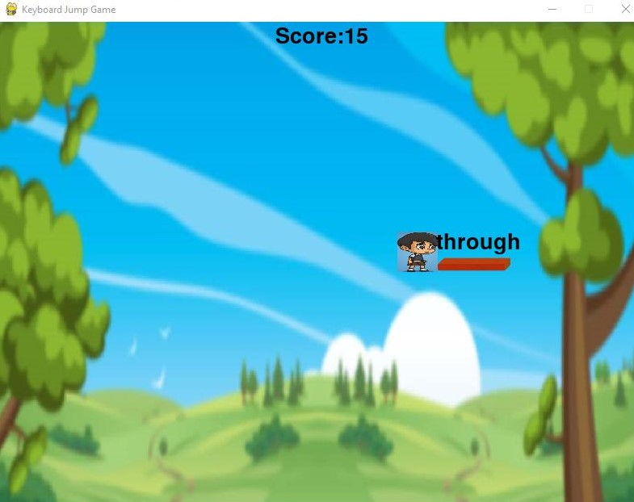

# Keyboard-Jump-Game

The typing game is a genre of video games that involves typing. Early typing games were a subgenre of educational games and used to familiarize players with keyboard use, but they later progressed to become their own category of games as players became more acclimated to the use of a keyboard and the games became more difficult and complex. Usually, a typing game will require the player to quickly or precisely type in words - or individual letters, numbers, or other keys - that display on the screen to proceed in the game, functioning as both a challenge and a means to improve one's skill at touch typing. 

## Output:

